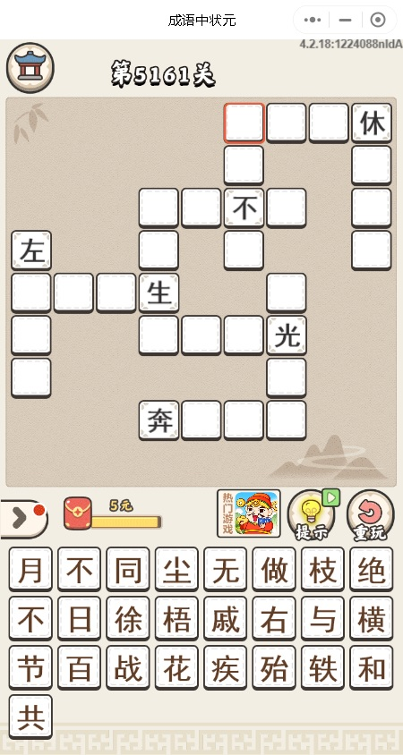

# 微信小游戏《成语中状元》答题助手
## 思路
1.微信电脑版进入微信小游戏《成语中状元》某一关，进行截图

2.通过ocr将题目内容识别出来

3.穷举匹配成语

## 所需软件
* * Anaconda，在Windows运行

## 使用方法
1.请先安装Anaconda，把其中的python3可执行文件设为系统默认的python可执行文件

2.安装百度ocr库
```shell
pip install baidu-aip
```

3.在[百度云](https://cloud.baidu.com/product/ocr.html)中创建一个项目，获取相应的app id、api key以及secret_key，在config.py中进行替换

4.进入微信电脑版进入微信小游戏《成语中状元》某一关，如下：


4.在Windows命令行执行
```shell
python main.py
```

5.程序会在成语成语库中搜索成语，请自行判断正确答案
如上题会返回：
```
不做不休
百战不殆
不疾不徐
不日不月
不徐不疾
左枝右梧
百花生日
横生枝节
枝节横生
和光同尘
日月无光
奔轶绝尘
以下为备选字能组成的成语：
百战不殆
不疾不徐
不日不月
不徐不疾
```

因为有时有些字会识别不到，所以仅为参考答案